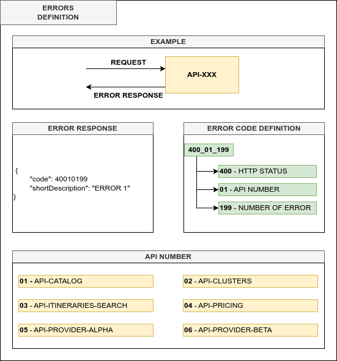

# # Edteam  - Curso: Introduccion a las pruebas end-to-end con Java

[](https://opensource.org/licenses/MIT)

Este repositorio contiene todo lo necesario para poder seguir el curso desde el inicio hasta el final.

## Tabla de contenidos

Los suguientes son los topicos o puntos mas relevantes de este archivo:
- [Requerimientos](#Requerimientos)
- [Comprobar requerimientos](#Comprobar-requerimientos)
- [Arquitectura](#Arquitectura)
    - [Microservicios](#Microservicios)
    - [Flujos](#Flujos)
      - [Searching](#Searching)
      - [Booking](#Booking)
- [Documentacion de los endpoints](#Documentacion-de-los-endpoints)
- [Consideraciones](#Consideraciones)
- [Preguntas frecuentes](#Preguntas-frecuentes)

## Requerimientos

Para poder utilizar el código de este proyecto deberás tener las siguientes herramientas instaladas:

- [Java](https://www.oracle.com/ar/java/technologies/downloads/)
- [Maven](https://maven.apache.org/)
- [Git](https://git-scm.com/)
- [Docker](https://www.docker.com/)

Si no tienes algunas de estas herramientas instaladas en tu computadora, sigue las instrucciones en la documentación oficial de cada herramienta.

## Comprobar requerimientos


Si instaló en su computadora algunas de estas herramientas anteriormente o instalaste todas las herramientas ahora, verifica si todo funciona bien.

- Para comprobar que version de Java tenes en tu computadora podes usar este comando:
   ````
   % java -version
  openjdk 17.0.6 2023-01-17 LTS
  OpenJDK Runtime Environment Microsoft-7209853 (build 17.0.6+10-LTS)
  OpenJDK 64-Bit Server VM Microsoft-7209853 (build 17.0.6+10-LTS, mixed mode, sharing)
   ````

- Comprueba si la version de Maven es 3.8.0 o superior. Puedes comprobar la version de Maven con el siguiente comando:
   ````
   % mvn --version
   Apache Maven 3.8.3
   Maven home: /usr/share/maven
   ````

- Comprueba si la version de Docker que se encuentra en tu computadora es 18.09.0 o superior. Puedes comprobar la version de Docker con el siguiente comando:
   ````
   % docker --version
  Docker version 24.0.2, build cb74dfc
   ````

## Arquitectura

Los microservicios son una abstracción de todo el flujo para crear reservas de una agencia que vende vuelos.

#### Microservicios

El sistema se compone de los siguientes microservicios:
* **api-catalog** este microservicio contiene toda la informacion relacionada con un catalogo de ciudades.
* **api-clusters** es un microservicio que contiene todas las validaciones sobre los parámetros de búsqueda. Además, llama a api-pricing para obtener el precio final de cada itinerario.
* **api-pricing** es un microservicio que contiene todas las reglas para agregar un margen de beneficio a cada itinerario y calcular el precio final de cada uno de ellos.
* **api-itineraries-search** es un microservicio que contiene toda la lógica, a la que los proveedores deben llamar para obtener todos los itinerarios. Además, este microservicio elimina duplicados.
* **api-provider-alpha** es un microservicio que simula obtener la información de un proveedor externo.
* **api-provider-beta** es un microservicio que simula obtener la información de un proveedor externo.
* **api-reservation** este microservicio contiene toda la informacion de las reservas de una empresa que vende pasajes aereos.

#### Flujos
Esta sección te mostrará los dos flujos diferentes que tiene la plataforma. El primer flujo consiste en obtener todos los itinerarios para reservar uno; el segundo toma uno de los itinerarios y crea una reserva validando valores específicos.

##### Searching
El flujo de cada solicitud de búsqueda tiene los siguientes pasos:
1. **API-Clusters** recibe una solicitud y valida información común como el número de pasajeros y su distribución, la fecha de salida y alguna otra información.
2. **API-Clusters** realiza una solicitud de cada ciudad para validar la existencia de esa ciudad.
3. **API-Clusters** realiza una solicitud con toda la información relacionada con la búsqueda a **API-Itineraries-search**.
4. **API-Itinerarios-búsqueda** encuentra todos los proveedores y realiza una solicitud con la misma información que la reciben.
5. Cada proveedor obtiene todos los itinerarios que coincidan con las condiciones de la solicitud. Además, cada proveedor realiza varias solicitudes para obtener la zona horaria de cada ciudad y con esta información calcular la duración de cada vuelo.
6. **API-Clusters** envía todos los itinerarios a **API-Pricing** para obtener toda la información sobre el margen de beneficio de cada vuelo y cuál es el precio final.
7. Los **API-Clusters** guardan las respuestas completas durante un breve período en la base de datos de Redis porque la búsqueda está paginada, por lo que los **API-Clusters** usan la base de datos para evitar volver a realizar la misma búsqueda solo para obtener la siguiente. página el resultado. 

La siguiente imagen ilustra el flujo descrito anteriormente.
[Flujo](.images/Search-API-Flow.png)

Además, puedes ver el flujo con más detalle en esta imagen:


##### Booking
El flujo de cada solicitud de reserva tiene los siguientes pasos:
1. **API-Reservation** recibe una solicitud y valida información común antes de verificar alguna información que existe en otros microservicios.
2. **API-Reservation** realiza una solicitud a **API-Clusters** para validar si itinerary_id existe o no en la base de datos.
3. **API-Reservation** realizar una solicitud a **API-Catalog** para validar si existe o no la nacionalidad de los pasajeros.
4. **API-Reservation** conserva la información en la base de datos.


La siguiente imagen ilustra el flujo descrito anteriormente.


Además, puedes ver el flujo con más detalle en esta imagen:


#### Definición de errores

Cada microservicio debe tener algún error para identificar qué tipo de excepción ocurre y los desarrolladores o analistas de negocios podrían comprender exactamente qué sucedió con una solicitud.
La siguiente imagen ayuda a entender cómo definir este código de error en cada microservicio:



## Documentacion de los endpoints

Cada API tiene documentación para comprender qué parámetros son necesarios y la URL para invocarlos. Para ver la documentación de la API es necesario ejecutar cada proyecto y acceder a:
- [Swagger - Reservation](http://localhost:3070/api/flights/reservation/documentation)
- [Swagger - Clusters](http://localhost:4070/api/flights/clusters/documentation)
- [Swagger - Pricing](http://localhost:5070/api/flights/pricing/documentation)
- [Swagger - Catalog](http://localhost:6070/api/flights/catalog/documentation)
- [Swagger - Itineraries Search](http://localhost:7070/api/flights/itineraries-search/documentation)
- [Swagger - Provider Alpha](http://localhost:8070/api/flights/provider/alpha/documentation)
- [Swagger - Provider Beta](http://localhost:9070/api/flights/provider/beta/documentation)

Opcionalmente puedes usar [**Postman**](https://www.postman.com/) para realizar request desde los diferentes microservicios, el repositorio incluye un archivo con una coleccion con todos los endpoints.

## Consideraciones

Para ejecutar todos los microservicios en la misma máquina, debes considerar que los siguientes puertos deben estar disponibles para usarlo:

| Name                   | Application | Database    |
|------------------------|-------------|-------------|
| api-reservation        | 3070        | 5079        |
| api-clusters           | 4070        | 6079        |
| api-pricing            | 5070        | 3010        |
| api-catalog            | 6070        | 3011        |
| api-itineraries-search | 7070        | ---         |
| api-provider-alpha     | 8070        | ---         |
| api-provider-beta      | 9070        | ---         |

## Preguntas frecuentes

**¿Qué versión del JDK puedo usar en este proyecto?**

No hay restricción sobre qué versión en particular debes considerar, ya que existen diferentes alternativas al JDK:

* **OracleJDK**: Esta versión era gratuita hasta Java 11, después de esta versión puedes usarla para entornos de desarrollo/prueba, pero debes pagar una licencia para usarla en producción. Esta versión del JDK le ofrece los parches de errores más recientes y nuevas funciones porque Oracle es el propietario del lenguaje.


* **OpenJDK**: Cuando Oracle compró Sun Microsystems, creó esto como una alternativa de código abierto que todos los desarrolladores pueden usar en cualquier entorno sin restricciones. El principal problema de esta versión es que los parches de los errores tardan en aparecer en los casos que no son críticos.

Tenga en cuenta que existen otras alternativas, pero según el [Informe Snyk 2021](https://res.cloudinary.com/snyk/image/upload/v1623860216/reports/jvm-ecosystem-report-2021.pdf), la mayoría de los desarrolladores utilizan OpenJDK.

**¿Qué herramientas puedo utilizar para el desarrollo?**

Hay un sin fin de herramientas para el desarrollo, quizas las dos mas importantes son:
- [IntelliJ IDEA Community Edition](https://www.jetbrains.com/idea/) – IntelliJ es el IDE más utilizado para el desarrollo.

- [Eclipse](https://www.eclipse.org/downloads/) – Eclipse es otra opción IDE para el desarrollo. La mayoría de los complementos son gratuitos y cuentan con una amplia comunidad de desarrolladores que los actualizan con frecuencia.

Tenga en cuenta que existen otros IDE, pero según el [Informe Snyk 2021](https://res.cloudinary.com/snyk/image/upload/v1623860216/reports/jvm-ecosystem-report-2021.pdf), la mayoría de Los desarrolladores de JVM utilizan Eclipse e Intellij, pero el uso del código de Visual Studio está creciendo en el último año.
